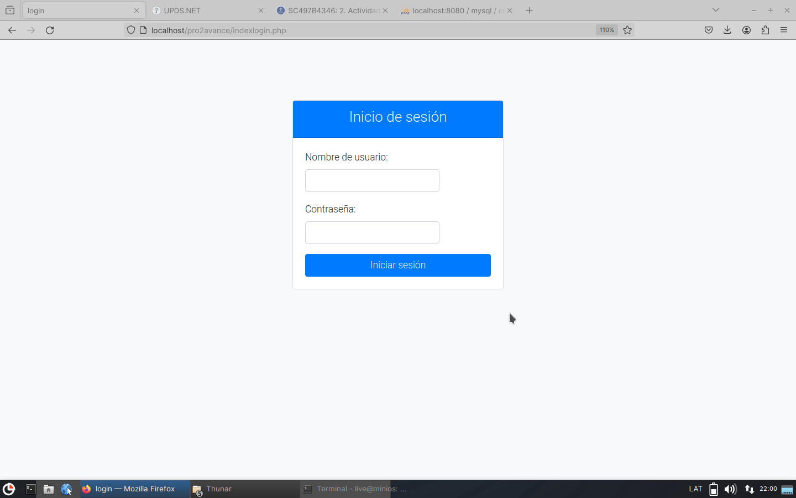
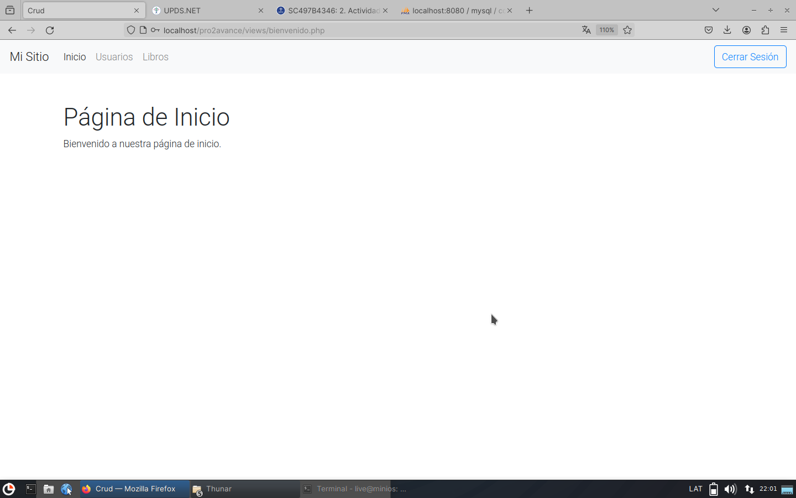
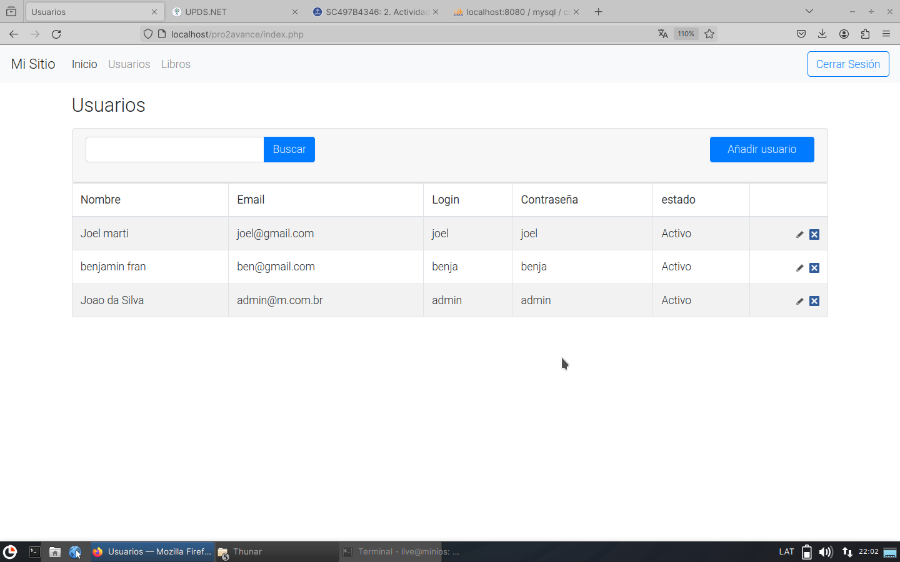
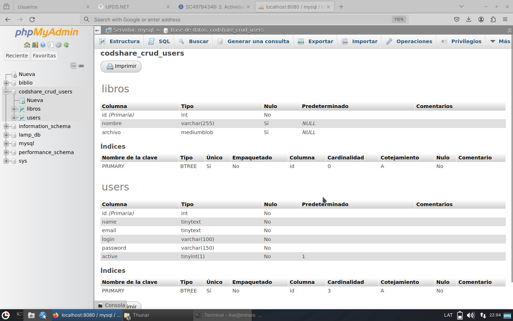

# Proyecto UPDS Tecnologia Web II
Este sistema de gestion de administracion.

Las tecnologias implementadas para el proyecto seran las siguientes:
 - Html
 - CSS
 - PHP
 - javascript
 - Ajax 
   
# Server
Mysql    

ENTORNO DE DESARROLLO DOCKER      
Entorno de desarrollo LAMP con Docker Compose 
comandos a ejecutar:    
git clone https://github.com/josejuansanchez/lamp-docker    
cd lamp-docker     
sudo docker compose up -d         
https://josejuansanchez.org/iaw/practica-php/index.pdf           

# Login

# Inicio

# Usuario

# DATABASE
MYSQL MariaDB PhpMyAdmin 

notas:    
iniciar /pro2avance/indexlogin.php     
usuario admin     
contraseña admin

todo fue elaborado en una maquina virtual de Linux

